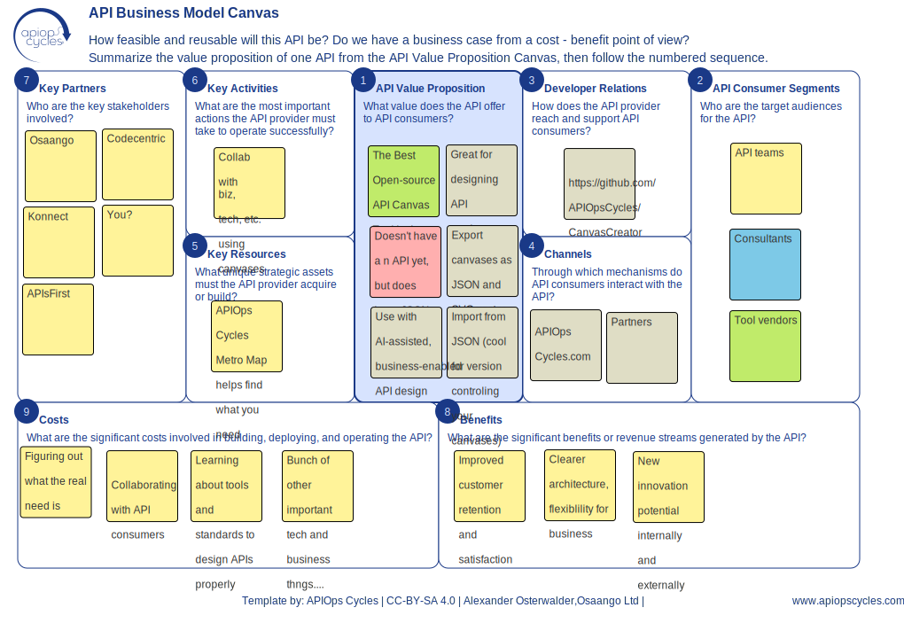
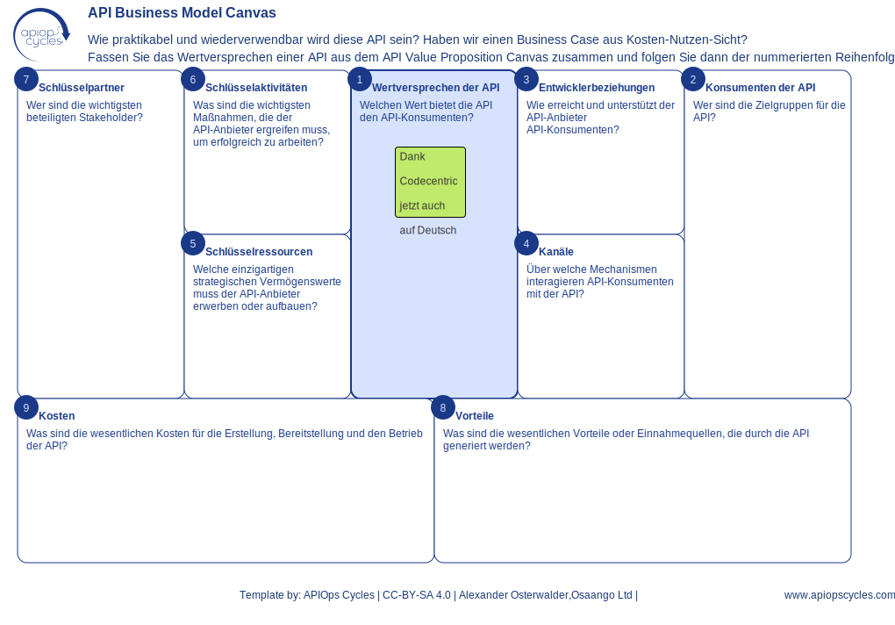

# APIOps Cycles Canvas Creator




See the same canvas exported from CanvasCreator as [SVG vector image](examples/Canvas_apiBusinessModelCanvas_en-US.svg) or [structured JSON](examples/Canvas_apiBusinessModelCanvas_en-US.json) that you can save to version control or your computer and upload again, to continue editing or share with your colleagues, customers or fellow students.

Example of localized version in German (de-DE) - join the translation effort by creating a pull request. See more info below.



## Overview
The **APIOps Cycles Canvas Creator** is a web-based tool designed to create and manage various API-related canvases, such as API Business Model Canvas, API Value Proposition Canvas, and others. The tool allows users to:

- Select a canvas type and language. 
- Add and manage sticky notes.
- Customize metadata.
- Export canvases as JSON, SVG or PNG.
- Work entirely in the browser with no server dependencies or saving data elsewhere.

For similar, but more integrated commercial tool, you can refer to one of our partners QriarLabs. Also for consulting or training services on how to use the canvases check our partner page for more information: [APIOps Partners](https://www.apiopscycles.com/partners)

## Features
- **Supports Multiple Canvases**: API Business Model, Value Proposition, Business Impact, Capacity, Customer Journey, Domain, Event, Interaction, Locations, and REST Canvases. Supports all canvases that are available at [the APIOps Cycles method website ](https://www.apiopscycles.com/) > Resources.
- **Localization Support**: JSON-based language switching (currently supports English, German, Finnish and French). To help with localization, contribute to the
     ```
     data/localizedData.json
     ```
- **Sticky Notes**: Users can create, edit, move, and delete sticky notes dynamically.
- **Mobile and touch support**: While the canvas it self does not scale for usability, the touch events for mobile devices and responsive styles have been implemented. Turn small devices in landscape position.  
- **Metadata Editing**: Allows customization of metadata (source, license, authors, website). Metadata will show at the footer of the canvas. **Do not edit the template metadata unless you are contributing to the canvas structure**. The canvases are licensed under CC-BY-SA 4.0, so share a like and mention original authors if you create any derivatives.
- **Export & Import**: Save and load canvases using JSON files. Allows saving data in version control or file server, or using it for other purposes. 
 - **SVG & PNG Export**: Generate vector or raster images for presentations and documentation (in slides, collaboration tools, print or web).

## Installation & Usage

You can use the Canvas Creator on our website [https://canvascreator.apiopscycles.com/](https://canvascreator.apiopscycles.com/) or install it on your server. We do not promise any SLAs, and as this tool is provided for free, the bandwidth may sometimes be limited. 

### 1. Hosting on Netlify (or Any Static Server)
This project can be hosted on any web server that allows execution of HTML and JavaScript. 

## File Structure
```
CanvasCreator/
├── index.html                 # Main HTML file
├── dist/                      # Bundled output from `npm run build` (not tracked)
│   ├── canvascreator.cjs
│   ├── canvascreator.esm.js
│   └── canvascreator.esm.min.js
├── src/                       # Modular JavaScript source
│   ├── helpers.js
│   ├── main.js
│   └── index.js
├── scripts/                   # Helper scripts
│   └── noteManager.js
├── styles/                    # Editable CSS sources
│   └── canvascreator.css
├── canvascreator.min.css      # Minified CSS version
├── data/                      # Canvas layouts and localization strings
│   ├── canvasData.json
│   └── localizedData.json
├── examples/                  # Sample canvases
├── tests/                     # Jest unit tests
├── img/                       # Images
└── LICENSE
```

## Build

Run `npm run build` to compile the library using [Rollup](https://rollupjs.org/). The command also minifies the JavaScript using the `@rollup/plugin-terser` plugin and the CSS using [`clean-css`](https://github.com/jakubpawlowicz/clean-css). It produces CommonJS, ESM and a minified ESM bundle in `dist/` together with the minified CSS and assets:

```
dist/
  canvascreator.cjs        # CommonJS
  canvascreator.esm.js     # ESM
  canvascreator.esm.min.js # Minified ESM
  canvascreator.min.css    # Minified CSS
  img/                     # Images used by index.html
  index.html               # Generated demo page
```

Both formats include the same API so your bundler can pick whichever it understands. CSS minification is handled by the `minify-css` script which uses `clean-css`.

The build also runs automatically when installing from git or publishing the package thanks to the `prepare` script in `package.json`.

To use the library directly in a browser without a bundler, load the minified ESM file:

```html
<script type="module" src="canvascreator.esm.min.js"></script>
```

During the build, `scripts/updateVersion.js` copies `index.html` and the
necessary images into the `dist` folder. It also replaces the
`v=<%= version %>` placeholders so browsers always load the latest CSS and
JavaScript files.

## Using in Front-end Projects

Import the functions directly from the package in any bundler-based setup. For example with [Astro](https://astro.build/). Make sure [D3.js](https://d3js.org/) is loaded separately and copy `canvascreator.min.css` and the `img` directory from the package to your public folder.

```astro
---
import CanvasCreator from "canvascreator";
---
<div id="canvasCreator"></div>
<script type="module">
  CanvasCreator.initCanvasCreator({ assetBase: "/" });
  CanvasCreator.loadCanvas("en-US", "apiBusinessModelCanvas");
</script>
```

The optional `assetBase` setting tells the library where to load `img` and CSS files from. It defaults to an empty string which points to the site root.

Any framework that supports ES modules (React, Vue, etc.) can use the same API.


## Command Line Export

You can also export canvases outside the browser using Node.js. The helper
script `scripts/export.js` reads the canvas definitions and generates JSON,
SVG, or PDF output. Install the package and run the bundled CLI:

```sh
npx canvascreator-export --locale en-US --format svg --all --prefix My
```

If you've cloned this repository you can alternatively run:

```sh
npm run export -- --locale en-US --format svg --all --prefix My
```

Options:

- `--locale <code>` – language for the exported canvas (default `en-US`)
- `--format <json|svg|pdf|png>` – output file type
- `--prefix <name>` – prefix for generated filenames (default `Canvas`)
- `--all` – export every canvas from `data/canvasData.json`
- `--canvas <id>` – export a single canvas by id
- `--import <file>` – load an existing JSON content file instead of creating
  placeholders

Files are written to an `export/` subdirectory following the pattern
`export/{prefix}_{canvasId}_{locale}.ext`.

## How to Contribute
Contributions are welcome, especially localization help, bug fixing, or contributing libraries in other languages or frameworks!

Follow these steps to contribute:
1. **Fork the Repository**
2. **Create a New Branch**
   ```sh
   git checkout -b feature-your-feature-name
   ```
3. **Make Changes & Commit**
   ```sh
   git commit -m "Added new feature"
   ```
4. **Push Changes**
   ```sh
   git push origin feature-your-feature-name
   ```
5. **Submit a Pull Request**

## Testing
Unit tests run with [Jest](https://jestjs.io/). Install dependencies and run:

```sh
npm install
npm test
```

The test suite also runs automatically in GitHub Actions for each push and pull request.

## Versioning & Caching
The stylesheet is referenced with a version query
(`canvascreator.min.css?v=<version>`) so browsers load the latest minified CSS.
When serving the JavaScript bundles directly in the browser, use
`canvascreator.esm.min.js?v=<version>` so you can bump the query string to
invalidate cached copies on release.

## License
This project is licensed under the **Apache 2.0 License**. See the `LICENSE` file for details.

## Release Notes
See [CHANGELOG.md](CHANGELOG.md) for a detailed list of changes.

## Contact
For any issues, feature requests, or questions, please create an issue in the [GitHub repository](https://github.com/APIOpsCycles/CanvasCreator/issues).

## Sponsors and partners
If your organization would like to support the method and gain more skills and visibility, check our partner page for more information: [APIOps Partners](https://www.apiopscycles.com/partners)
